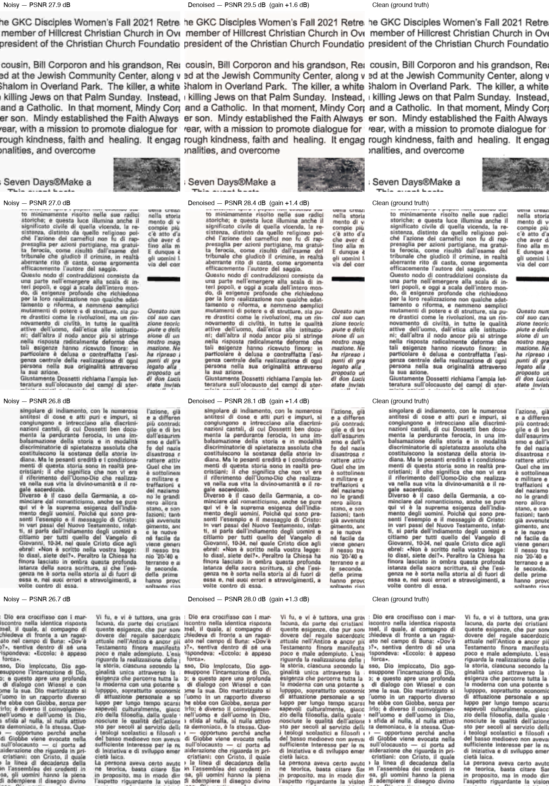

# Document Image Denoising

This project supports training and evaluating deep neural network architectures to denoise and sharpen document images degraded by JPEG compression and other artifacts. The pipeline is end-to-end: PDF pages are rendered to high-resolution crops, and during training a configurable degradation pipeline synthesizes noise on the fly, teaching the model to recover clean text and structure.

The pipeline:

1. Render PDF pages to 512×512 crops at 288 DPI (PyMuPDF at `--scale 4.0`).
2. Filter crops by content quality — rejects mostly-blank regions.
3. During training, apply the degradation pipeline per crop: optional Gaussian blur → JPEG round-trip at random quality → optional Gaussian noise.
4. Train the chosen backbone to map degraded → clean.

## Demo



## Project layout

```
.
├── data/crops/clean/                  # generated dataset (gitignored)
├── notebooks/
│   └── kaggle_train.ipynb             # runnable: clone + train on a free Kaggle GPU
├── outputs/                           # checkpoints + logs (gitignored)
├── src/denoising/
│   ├── conf/                          # Hydra configs (data, model, trainer, logger, predict, infer)
│   ├── callbacks.py                   # W&B prediction image logging callback
│   ├── data/
│   │   ├── dataset.py                 # DocumentDenoisingDataset
│   │   ├── datamodule.py              # LightningDataModule (split + dataloaders)
│   │   ├── transforms.py              # Degradation pipeline (JPEGNoise, GaussianNoise, GaussianBlur)
│   │   └── extract_crops.py           # PDF → clean crops, CLI
│   ├── models/
│   │   ├── unet.py                    # UNet, PlainEncoderDecoder, ResidualUNet (nn.Module backbones)
│   │   ├── swin2sr.py                 # Swin2SR wrapper (HuggingFace pretrained fine-tune)
│   │   └── lit_module.py              # LightningModule (loss, optimizer, metrics)
│   ├── utils/                         # device + metrics
│   ├── train.py                       # entry point, Hydra @main
│   ├── predict.py                     # demo grid generator, Hydra @main
│   └── infer.py                       # tiled full-image inference, Hydra @main
├── tests/test_smoke.py                # 1-step model + metric tests
└── pyproject.toml                     # installable package + console scripts (single source of deps)
```

Architecture is decoupled from training: backbone models are pure `nn.Module` classes importable from notebooks or tests; `DenoisingLitModule` is the Lightning wrapper that owns loss, optimizer, and metric logging, and selects the backbone by name from config.

## Setup

```bash
conda create -n denoise python=3.13
conda activate denoise
pip install -e .
```

(Or use a venv: `python3.13 -m venv .venv && source .venv/bin/activate && pip install -e .`.)

### Hardware

Training uses `accelerator: auto` — Lightning automatically selects the best available device:
- **Apple Silicon Mac** → MPS
- **Linux/Windows with NVIDIA GPU** → CUDA
- **CPU fallback** — works but slow

No code or config changes are needed when switching machines.

### Optional: Weights & Biases experiment tracking

Create a free account at [wandb.ai](https://wandb.ai), then log in once:

```bash
wandb login
```

Credentials are stored locally and never need to be entered again. Without this step, training still works — it defaults to CSV logging.

### Running on Kaggle (free GPU)

Training locally works but is slow on a laptop. [Kaggle Notebooks](https://www.kaggle.com/code) give free T4/P100 GPU time (30 GPU-hours/week, phone verification required) with no code changes — same `pip install -e .` package, same Hydra CLI overrides, just different paths.

1. Upload `data/crops/clean/` as a private [Kaggle Dataset](https://www.kaggle.com/datasets).
2. Open `notebooks/kaggle_train.ipynb` in this repo, and import it as a new Kaggle Notebook (File → Import Notebook).
3. In the notebook's Settings: turn on a GPU accelerator and Internet access, then attach your dataset via **+ Add Input**.
4. Run the cells. The notebook clones this repo fresh, installs it, auto-detects the mounted dataset's crop directory, and calls `denoising-train` with `data.clean_dir` / `hydra.run.dir` overridden to Kaggle paths.

Because the notebook clones from GitHub rather than using local files, **push any config/code changes before running it** — it always trains whatever is currently on `main`, not your working tree.

## Usage

All commands are available as console scripts after `pip install -e .`. Configs live in `src/denoising/conf/` and any value is overridable on the CLI via Hydra dotted syntax (`data.batch_size=4`, `++trainer.fast_dev_run=true`, etc.).

### Step 1 — Provide source PDFs

Drop a folder of PDFs anywhere. Any PDFs work: reports, manuals, articles, scanned forms. The more variety, the better the model generalizes.

### Step 2 — Generate the training crops

```bash
denoising-extract-crops \
    --pdf-dir ~/Downloads/pdfs \
    --output-dir data/crops \
    --crop-size 512 \
    --scale 4.0 \
    --target-crops 10000 \
    --max-pages-per-pdf 10 \
    --crops-per-page 6
```

Pages are rendered at `--scale 4.0` (288 DPI) for sharp text, then 512×512 crops are cut at random positions. Stops at `--target-crops`. Use `--min-std` / `--max-mean` to tune the blank-region filter.

### Step 3 — Train

```bash
denoising-train trainer.max_epochs=20 hydra.run.dir=outputs/my_run
```

Each run writes to its own directory under `hydra.run.dir` — checkpoints go to `<run_dir>/checkpoints/` and logs to `<run_dir>/logs/`. Running two experiments in parallel requires separate `hydra.run.dir` values so outputs don't collide.

**Useful overrides:**
- `model=unet` / `model=residual_unet` / `model=plain_encoder_decoder` / `model=swin2sr` — swap backbone.
- `model.backbone_cfg.base_channels=32` — smaller model for limited hardware.
- `data.batch_size=4` — reduce if running out of GPU memory.
- `trainer.max_epochs=20` — number of epochs.
- `ckpt_path=outputs/my_run/checkpoints/last.ckpt` — resume from a checkpoint.
- `++trainer.fast_dev_run=true` — 1 train + 1 val step, sanity check the pipeline.

**With Weights & Biases tracking** (requires `wandb login` first):

```bash
denoising-train logger=wandb trainer.max_epochs=20 hydra.run.dir=outputs/my_run
```

Each W&B run logs:
- `train_loss`, `val_loss`, `val_psnr` curves
- Full hyperparameter config (backbone, lr, batch size, degradation pipeline, etc.)
- Sample noisy / denoised / clean image triplets at the end of each validation epoch, with source filenames in captions
- System metrics (CPU, RAM, GPU memory) automatically

### Step 4 — Generate demo samples

```bash
denoising-predict predict.checkpoint=outputs/my_run/checkpoints/last.ckpt predict.num_samples=4 predict.demo_quality=5
```

Picks the top-N crops by PSNR gain and stacks them into `demo.png`.

### Step 5 — Denoise a full document image

```bash
denoising-infer infer.checkpoint=outputs/my_run/checkpoints/last.ckpt infer.input=page.png
```

Accepts an image of any size. The image is split into overlapping tiles, each denoised independently, and blended back together using a 2D Hann window to eliminate seam artifacts. Output is saved next to the input as `<name>_denoised.<ext>` unless `infer.output` is specified.

## Degradation pipeline

Noise is synthesized per crop during training by applying steps in order. Each step has a `prob` and random parameter ranges. The default pipeline (`conf/data/default.yaml`):

| Step | Default prob | Parameters |
|---|---|---|
| `gaussian_blur` | 0.3 | radius ∈ [0.1, 1.0] |
| `jpeg` | 1.0 | quality ∈ [10, 50] |
| `gaussian_noise` | 0.5 | sigma ∈ [0.0, 0.02] |

To override from the CLI:

```bash
denoising-train 'data.degradations=[{type: jpeg, prob: 1.0, quality_min: 5, quality_max: 30}]'
```

To add a new degradation: implement a callable class in `transforms.py`, register it in `DegradationPipeline._REGISTRY`, and add an entry to the YAML.

## Architecture

Four backbones are provided out of the box:

| Config key | Class | Description |
|---|---|---|
| `unet` | `UNet` | Three encoder/decoder levels with skip connections (64→128→256→512 bridge) |
| `plain_encoder_decoder` | `PlainEncoderDecoder` | Same depth, no skip connections — ablation baseline for UNet |
| `residual_unet` | `ResidualUNet` | UNet that predicts the noise residual and subtracts it from the input |
| `swin2sr` | `Swin2SRDenoiser` | Swin Transformer V2 fine-tuned from HuggingFace pretrained weights |

`unet`, `plain_encoder_decoder`, and `residual_unet` use `DoubleConv` blocks (two 3×3 convolutions + BatchNorm + ReLU) and are trained from scratch. `swin2sr` loads pretrained backbone weights from `caidas/swin2SR-lightweight-x2-64` on HuggingFace and fine-tunes them for artifact removal. All models are fully convolutional and accept any input resolution — training uses 512×512.

To add a new architecture: implement an `nn.Module` in `models/`, register it in `_BACKBONES` in `lit_module.py`, and add a YAML under `conf/model/`.

## Evaluation metric

**PSNR (Peak Signal-to-Noise Ratio)** is the standard metric for image restoration benchmarks (denoising, super-resolution, compression). It is defined as:

```
PSNR = 10 · log₁₀(MAX² / MSE)
```

where MAX = 1.0 for normalized images. PSNR is monotonically related to pixel-wise MSE — they carry identical information — but expressed in decibels, which makes differences more interpretable (every +3 dB ≈ halving the mean squared error) and comparable to published work.

## Tests

```bash
pip install -e ".[dev]"
pytest tests/
```

Smoke tests verify forward shape, backward pass, and the PSNR helper — fast (<1s) and catch dimension mismatches before a real training run.

## Next steps

- Replace BatchNorm with GroupNorm — early epochs are unstable while BN running stats warm up.
- Tune `base_channels` for available compute; larger models improve quality but slow training.
- Add a Dockerfile for reproducible training environments and cloud deployment.
